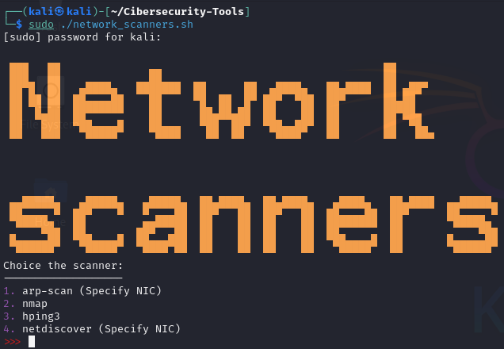

# Cibersecurity-Tools
Herrameintas de seguridad informática

## getIPInfo.py
Ejecución
```bash
python3 getIpInfo.py -i 192.168.25.1
```

```bash
python3 getIpInfo.py -i 192.168.25.1/24
```

```bash
python3 getIpInfo.py -i 192.168.25.1/24 10.10.10.0
```

```
usage: getIpInfo.py [-h] --ips IPS [IPS ...]

IPv4 information

options:
  -h, --help            show this help message and exit
  --ips IPS [IPS ...], -i IPS [IPS ...]
                        IP addresses

```

## getLocalNetPasswords.sh
Ejecución
```bash
sudo ./getLocalNetPasswords.sh
```

## Network_scanner.sh
Ejecución:
```bash
sudo ./network_scanners.sh
```
En caso de que no tenga permisos de ejecución:
```bash
chmod +x network_scanners.sh
```

<p align=center>
    
</p>


## windows_networkScanner.py
Ejecución:
```bash
python windows_networkScanner.py
```
> Te perdirá permisos de administrador


## linux_networkScanner.py
Ejecución:
```bash
sudo python3 linux_networkScanner.py
```

<p align=center>Output de linux y windows networkScanners.py</p>
<p align=center>
    
</p>

## passwordChecker.py
Ejecución:
```bash
usage: passwordChecker.py [-h] --passwd PASSWD --file FILE

Verifica si la contraseña se encuentra en una lista.

options:
  -h, --help       show this help message and exit
  --passwd PASSWD  Contraseña a verificar
  --file FILE      Lista de contraseñas
```